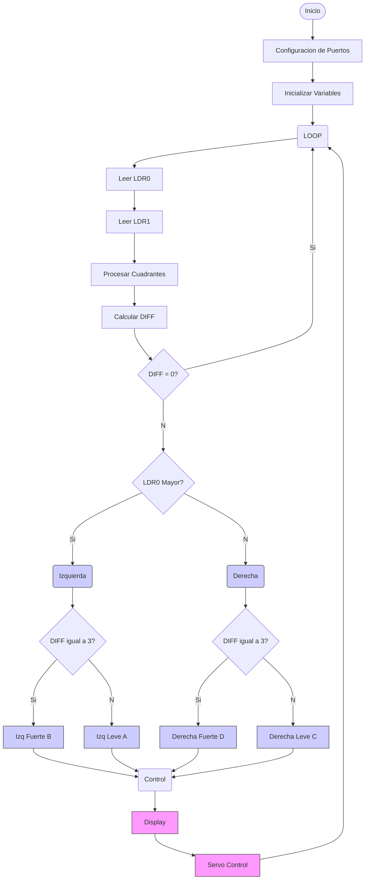

# Seguidor de Sol Automático (Solar Tracker)

## Trabajo Final Digital 2

### 1. Introducción y Objetivo del Proyecto

El **Seguidor de Sol Automático** (o *Solar Tracker*) es un sistema electromecánico diseñado para **orientar un panel solar** hacia la posición óptima para obtener la mayor luz del sol a lo largo del día. El objetivo principal de este proyecto es **maximizar la eficiencia de captación de energía lumínica** 

### 2. Marco Conceptual y Principios de Funcionamiento

#### 2.1. Principio Básico

El sistema se basa en la comparación de la intensidad lumínica detectada por dos **Fotoresistencias(LDRs)**. La diferencia en la lectura de voltaje entre los sensores indica la dirección en la que debe moverse el sistema para alinearse con la fuente de luz más intensa.

#### 2.2. Arquitectura de Control

Se implementa un PIC16F887 que ajusta la posición de un servomotor, en relación a las LDR conectadas, el mismo modula el pulso de salida en relación a la diferencia de potencial entre las resistencias variables, cabe decir que el calculo de las ressitencias para el divisor resistivo de los LDR´s se hizo para que la luz maxima que tuviera fuera la del flash del celular y la oscuridad maxima es el ldr totalmente tapado. Por otro lado, se establecio una comunicacion serie la cual, mediante una interrupcion externa, comunica a la computadora la posicion actual del servomotor, lo mismo ocurre en un modulo de 4 displays de 7 segmentos, el cual nos muestra con un "0" la psoicion actual.

### 3. Componentes de Hardware y Software

| Tipo | Componente | Descripción |
| :--- | :--- | :--- |
| **Microcontrolador** | PIC16f887 | Plataforma de desarrollo principal para procesar las lecturas y controlar los actuadores. |
| **Sensores** | Resistencias LDR (x2) | Utilizadas para detectar la intensidad lumínica y el diferencial de luz. |
| **Actuadores** | Servomotores (x1) | Para el eje vertical 
| **Otros** | Resistencias (10kΩ), Cables de conexión, Protoboard, Estructura de soporte, Display de 7 segmentos, placas experimentales, componentes pertinentes para la configuración y optimo funcionamiento de microcontrolador.
| **Software** | **MPLAB y AN1310** | Entorno de desarrollo para la programación y carga del código. |
| **Lenguaje** | **ASSEMBLER** Lenguaje de programación utilizado para implementar la lógica de control. |

### 4. Montaje e Instalación
El montaje en primera instancia fue realizado integramente en protoboard, luego de esto implementamos un "modulo" realizado en una placa experimental el cual se encargaba del control y polarización del módulo de 7 segmentos, este siendo practiamente indispensable para montarlo en un chasis, ya que en un protoboard no hbaria forma de mostrarlo de manera efectiva por los conexiones que pasan por encima.
La imagen adjunta es del montaje en protoboard y ese módulo mencionado, el mismo está realizado completamente con cables macho-macho, por eso se ve un poco desprolijo, tenemos intenciones de en un futuro, poder realizar las placas impresas, las cuales se encuentran el repositorio, son funcionales, pero por temas de no poseer las herramientas adecuadas, se decidio por evitarlo pues se producian muchos incomvenientes de funcionamiento.

  

Estas son Imagenes de los circuitos

**LDR**

  

**7 Segmentos**

  

**Configuración del PIC**

  

**PCB de LDR Y 7SEG**

  

### 5. Diagrama de Flujo del Código

### 6. Conclusión

El proyecto Seguidor de Sol cumplió con los objetivos planteados, demostrando la aplicación práctica de los conocimientos de la materia Digital 2 en el sensado (LDRs), el procesamiento de señales (Microcontrolador) y la actuación (Servomotores). La implementación de la lógica de control digital permite una respuesta eficiente a los cambios de la fuente de luz.

---

## Autores 

Este proyecto fue desarrollado por:

|  | Nombre |   |
| :--- | :--- | :--- |
| Alumno | **Juan Felipe Castilla** | [GitHub: @juan-felipe-castilla]((https://github.com/juan-felipe-castilla)) |
| Alumno | **Agustín Dalmazzo** | [GitHub: @agustindalmazzo-cyber](https://github.com/agustindalmazzo-cyber) |
| Alumno | **Benjamín Viberti** | [GitHub: @benjaviberti](https://github.com/benjaviberti) |

---
