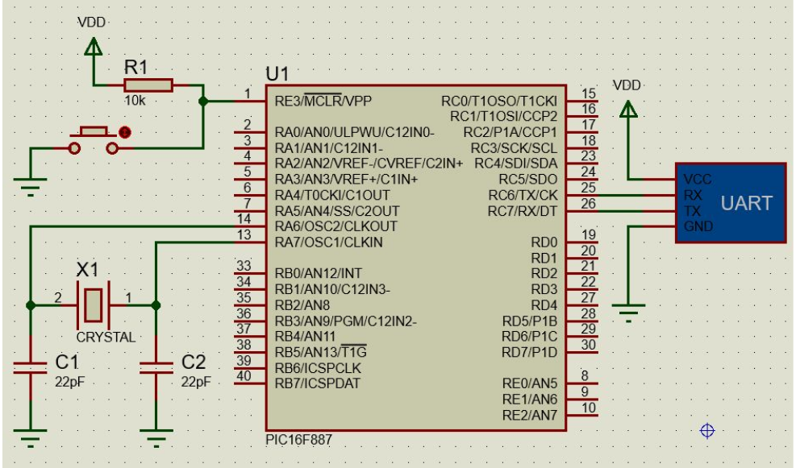
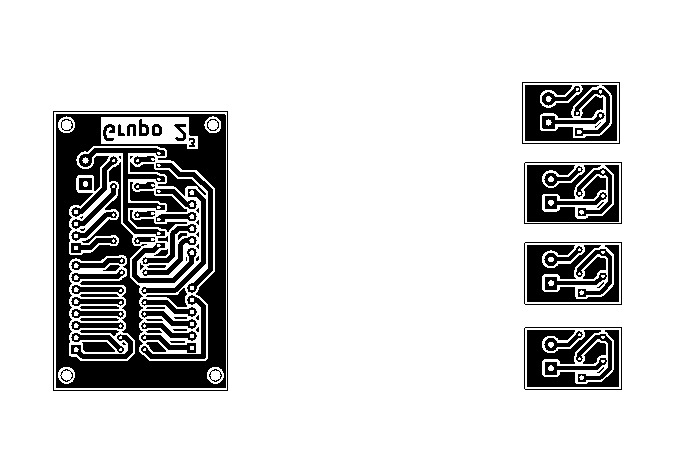

# Seguidor de Sol Automático (Solar Tracker)

## Trabajo Final Digital 2

### 1. Introducción y Objetivo del Proyecto

El **Seguidor de Sol Automático** (o *Solar Tracker*) es un sistema electromecánico diseñado para **orientar un panel** hacia la posición óptima del sol a lo largo del día. El objetivo principal de este proyecto es **maximizar la eficiencia de captación de energía lumínica** 

### 2. Marco Conceptual y Principios de Funcionamiento

#### 2.1. Principio Básico

El sistema se basa en la comparación de la intensidad lumínica detectada por dos **resistencias dependientes de la luz (LDRs)**. La diferencia en la lectura de voltaje entre los sensores indica la dirección en la que debe moverse el sistema para alinearse con la fuente de luz más intensa.

#### 2.2. Arquitectura de Control

Se implementa un PIC16F887 que ajusta la posición de un servomotor, en relación a las LDR conectadas, el mismo modula el pulso de salida en relación a la diferencia de potencial entre las resistencias variables.

### 3. Componentes de Hardware y Software

| Tipo | Componente | Descripción |
| :--- | :--- | :--- |
| **Microcontrolador** | PIC16f887 | Plataforma de desarrollo principal para procesar las lecturas y controlar los actuadores. |
| **Sensores** | Resistencias LDR (x2) | Utilizadas para detectar la intensidad lumínica y el diferencial de luz. |
| **Actuadores** | Servomotores (x1) | Para el eje vertical 
| **Otros** | Resistencias (10kΩ), Cables de conexión, Protoboard, Estructura de soporte, Display de 7 segmentos, placas experimentales, componentes pertinentes para la configuración y optimo funcionamiento de microcontrolador.
| **Software** | **MPLAB y AN1310** | Entorno de desarrollo para la programación y carga del código. |
| **Lenguaje** | **ASSEMBLER** Lenguaje de programación utilizado para implementar la lógica de control. |

### 4. Montaje e Instalación
El montaje en primera instancia fue realizado integramente en protoboard, luego de esto implementamos un "modulo" realizado en una placa experimental el cual se encargaba del control y polarización del módulo de 7 segmentos, este siendo practiamente indispensable para montarlo en un chasis, ya que en protoboard no teniamos forma de que el mismo se vea de la externa.
La imagen adjunta es del montaje en protoboard y ese módulo mencionado, el mismo está realizado completamente con cables macho-macho, por eso se ve un poco desprolijo, tenemos intenciones de en un futuro, poder realizar las placas impresas, las cuales se encuentran el repositorio, son funcionales, pero por temas de no poseer las herramientas adecuadas, traian más problemas q soluciones.

  

Estas son Imagenes de los circuitos

**LDR**

  

**7 Segmentos**

  

**Configuración del PIC**

  

**PCB de LDR Y 7SEG**

  

### 5. Diagrama de Flujo del Código
flowchart TD

%% ============================
%% SECCIÓN DE INICIO Y SETUP
%% ============================

A([RESET / Inicio]) --> B[Configurar Puertos I/O\nTRISA, TRISB, TRISC, ANSEL]
B --> C[Configurar Comunicación Serial\nTXSTA, RCSTA, SPBRG]
C --> D[Configurar ADC\nADCON0, ADCON1]
D --> E[Configurar Timer0\nOPTION_REG, TMR0]
E --> F[Configurar Interrupciones\nINTCON]
F --> G[Inicializar Variables\nconT,d0,d1,d2,d3,ADC0,ADC1,DIFF,P_DI,SP]

G --> H([Loop Principal])

%% ============================
%% LOOP PRINCIPAL
%% ============================

H --> I[Seleccionar AN0\nSELECCIONAR_AN0]
I --> J[Iniciar Conversión\nINICIAR_CONVERSION]
J --> K[Esperar Conversión\nESPERAR_CONVERSION]
K --> L[Guardar ADC0 → variable ADC0]

L --> M[Seleccionar AN1\nSELECCIONAR_AN1]
M --> N[Iniciar Conversión]
N --> O[Esperar Conversión]
O --> P[Guardar ADC1 → variable ADC1]

P --> Q[Procesar ADC0\nvalor_adc_raw=ADC0\nCALL CALCULAR_CUADRANTE]
Q --> R[RESP0 ← resultado]

R --> S[Procesar ADC1\nvalor_adc_raw=ADC1\nCALL CALCULAR_CUADRANTE]
S --> T[RESP1 ← resultado]

%% ============================
%% COMPARACIÓN DE LDRs
%% ============================

T --> U[Calcular DIFF = RESP1 - RESP0]

U --> V{DIFF = 0?}
V -- Sí --> H

V -- No --> W{DIFF > 0?\n(LDR1 > LDR0)}

%% ============================
%% IZQUIERDA
%% ============================

W -- No --> IZ[Procesar LDR0 Mayor]
IZ --> IZ2{DIFF = 3?}
IZ2 -- Sí --> IZ_F[Set P_DI = VALOR_B_IZQ_FUERTE (13)]
IZ2 -- No --> IZ_L[Set P_DI = VALOR_A_IZQ_LEVE (12)]

%% ============================
%% DERECHA
%% ============================

W -- Sí --> DE[Procesar LDR1 Mayor]
DE --> DE2{DIFF = 3?}
DE2 -- Sí --> DE_F[Set P_DI = VALOR_D_DER_FUERTE (15)]
DE2 -- No --> DE_L[Set P_DI = VALOR_C_DER_LEVE (14)]

%% ============================
%% SIGUE FLUJO
%% ============================

IZ_F --> IND
IZ_L --> IND
DE_F --> IND
DE_L --> IND

IND[Guardar P_DI]

IND --> LED[Activar MUX Display\nPRENDERLED]

LED --> SV[Control Servo\nVERIFICARP + P0/P1/P2/P3 rutinas]

SV --> H

%% ============================
%% INTERRUPCIONES
%% ============================

subgraph ISR [Interrupciones]
    ISR0[[ISR]] --> ISR1{INTF?}
    ISR1 -- Sí --> ISRA[COM_SERIE\n→ CARGAR_POSICION\n→ TXREG]
    ISR1 -- No --> ISR2{T0IF?}
    ISR2 -- Sí --> ISRT[TIMER_ISR\nIncrementa SP, CONTISR]
    ISR2 -- No --> ISR3[Restaurar Contexto\nRETFIE]
    ISRT --> ISR3
    ISRA --> ISR3
end

%% ============================
%% SUBRUTINAS PRINCIPALES
%% ============================

subgraph CALC [CALCULAR_CUADRANTE]
    C1[Chequear bits 7 y 6 de valor_adc_raw]
    C1 --> C2{B7=0?}
    C2 -- Sí --> CA0{B6=0?}
    CA0 -- Sí --> RET0[Return 0 (0–63)]
    CA0 -- No --> RET1[Return 1 (64–127)]

    C2 -- No --> CA1{B6=0?}
    CA1 -- Sí --> RET2[Return 2 (128–191)]
    CA1 -- No --> RET3[Return 3 (192–255)]
end

### 6. Conclusión

El proyecto Seguidor de Sol cumplió con los objetivos planteados, demostrando la aplicación práctica de los conocimientos de la materia Digital 2 en el sensado (LDRs), el procesamiento de señales (Microcontrolador) y la actuación (Servomotores). La implementación de la lógica de control digital permite una respuesta eficiente a los cambios de la fuente de luz.

---

## Autores 

Este proyecto fue desarrollado por:

|  | Nombre |   |
| :--- | :--- | :--- |
| Alumno | **Juan Felipe Castilla** | [GitHub: @juan-felipe-castilla]((https://github.com/juan-felipe-castilla)) |
| Alumno | **Agustín Dalmazzo** | [GitHub: @agustindalmazzo-cyber](https://github.com/agustindalmazzo-cyber) |
| Alumno | **Benjamín Viberti** | [GitHub: @benjaviberti](https://github.com/benjaviberti) |

---
